.. _mpnum-introduction:

Introduction
============

mpnum is a flexible, user-friendly, and expandable toolbox for the
matrix product state/tensor train tensor format.  It is available
under the BSD license at `mpnum on Github
<https://github.com/dseuss/mpnum>`_. mpnum provides:

- support for well-known matrix product representations, such as:

  - matrix product states (:ref:`MPS <intro-mps>`), also known as
    tensor trains (TT)
  - matrix product operators (:ref:`MPO <intro-mpo>`)
  - local purification matrix product states (:ref:`PMPS <intro-pmps>`)
  - arbitrary matrix product arrays (:ref:`MPA <intro-mpa>`)

- arithmetic operations: addition, multiplication, contraction etc.
- compression, canonical forms, etc. (see :func:`compress()
  <mpnum.mparray.MPArray.compress>`, :func:`canonicalize()
  <mpnum.mparray.MPArray.canonicalize>`)
- finding extremal eigenvalues and eigenvectors of MPOs (see
  :func:`eig() <mpnum.linalg.eig>`)

In this introduction, we discuss mpnum's basic data structure, the
:class:`MPArray <mpnum.mparray.MPArray>` (MPA).  If you are familiar
with matrix product states and want to see mpnum in action, you can
skip to the IPython notebook :code:`mpnum_intro.ipynb` (`view
mpnum_intro.ipynb on Github`_).

.. contents::

Matrix product arrays
---------------------

The basic data structure of mpnum is the class
:class:`mpnum.mparray.MPArray`.  It represents tensors in
matrix-product form in an opaque manner while providing the user with
a high-level interface similar to numpy's ``ndarray``.  Special cases
of MPAs include matrix-product states (MPS) and operators (MPOs) used
in quantum physics.

Graphical notation
""""""""""""""""""

Operations on tensors such as contractions are much easier to write down using
graphical notation [:ref:`Sch11 <Sch11>`, Figure 38].
A simple case of of a tensor contraction is the product of two matrices:

.. math::

   C = A B^T

We represent this tensor contraction with the following figure:

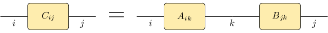

Each of the tensors :math:`A`, :math:`B` and :math:`C` is represented
by one box.  All the tensors have two indices (as they are matrices),
therefore there are two lines emerging from each box, called *legs*.
Connected legs indicate a contraction.  The relation between legs on
the left and right hand sides of the equality sign is given by their
position.  In this figure, we specify the relation between the indices
in a formula like :math:`B_{kl}` and the individual lines in the
figure by giving specifying the name of each index on each line.

In this simple case, the figure looks more complicated than the
formula, but it contains complete information on how all indices of
all tensors are connected.  To be fair, we should mention the indices
in the formula as well:

.. math::

   C_{ij} = \sum_{k} A_{ik} B_{jk}

Another simple example is the following product of two vectors and a
matrix:

.. math::

   c = u^\dagger A v = \sum_{ij} u^*_i A_{ij} v_j

This formula is represented by the following figure:

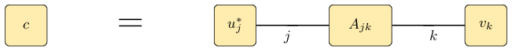

.. _intro-mps:

Matrix product states (MPS)
"""""""""""""""""""""""""""

The matrix product state representation of a state :math:`\vert \psi
\rangle` on four subsystems is given by

.. math::

   \langle i j k l \vert \psi \rangle = \psi_{ijkl} = A_i B_j C_k D_l

where each :math:`A_i \in \mathbb C^{1 \times D}`; :math:`B_j, C_k \in
\mathbb C^{D \times D}` and :math:`D_l \in \mathbb C^{D \times 1}`
(reference: e.g. [Sch11]_; :ref:`exact definition
<mpsmpo-definitions>`). This construction is also known as *tensor
train* and it is given by the following simple figure:

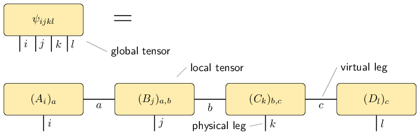

We call :math:`\psi` a *global tensor* and we call the MPS matrices
:math:`A_i`, :math:`B_j` etc. which are associated to a certain
subsystem *local tensors*.  The legs/indices :math:`i`, :math:`j`,
... of the original tensor :math:`\vert \psi \rangle` are called
*physical legs*.  The additional legs in the matrix product
representation are called *virtual legs*. The dimension (size) of the
virtual legs are called the *representation ranks* or *compression
ranks*. In the physics literature, the virtual legs are often called
*bonds* and the representation ranks are called *bond dimensions*.

Very often, we can omit the labels of all the legs.  The figure then
becomes very simple:

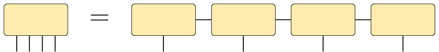

As explained in the next paragraph on MPOs, we usually add *dummy
virtual legs* of size 1 to our tensors:

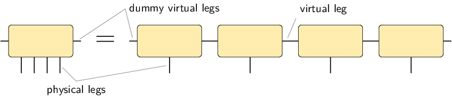

.. _intro-mpo:

Matrix product operators (MPO)
""""""""""""""""""""""""""""""

The matrix product operator representation of an operator :math:`\rho`
on three subsystems is given by

.. math::

   \langle i_1 i_2 i_3 \vert \rho \vert j_1 j_2 j_3 \rangle
   =
   \rho_{i_1i_2i_3,j_1j_2j_3} =
   A_{i_1j_1} B_{i_2j_2} C_{i_3j_3}

where the :math:`A_{i_1j_1}` are row vectors, the :math:`B_{i_2j_2}`
are matrices and the :math:`C_{i_3j_3}` are column vectors (reference:
e.g. [Sch11]_; :ref:`exact definition
<mpsmpo-definitions>`). This is represented by the following figure:

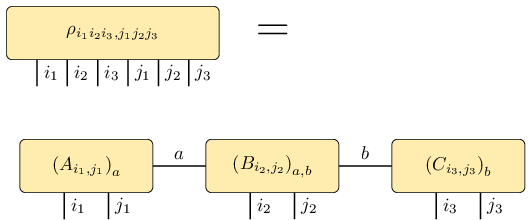

Be aware that the legs of :math:`\rho` are not in the order :math:`i_1
i_2 i_3 j_1 j_2 j_3` (called *global order*) which is expected from
the expression :math:`\langle i_1 i_2 i_3 \vert \rho \vert j_1 j_2 j_3
\rangle` and which is obtained by a simple reshape of the matrix
:math:`\rho` into a tensor.  Instead, the order of the legs of
:math:`\rho` must match the order in the MPO construction, which is
:math:`i_1 j_1 i_2 j_2 i_3 j_3`.  We call this latter order *local
order*. The functions :func:`global_to_local
<mpnum.utils.array_transforms.global_to_local>` and
:func:`local_to_global <mpnum.utils.array_transforms.local_to_global>`
can convert tensors between the two orders.

In order to simplify the implementation, it is useful to introduce
*dummy virtual legs* with index size 1 on the left and the right of
the MPS or MPO chain:

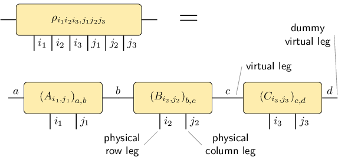

With these dummy virtual legs, all the tensors in the representation
have exactly two virtual legs.

It is useful to draw the physical column indices upward from the
global and local tensors while leaving the physical row indices
downward:

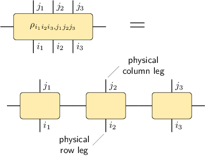

With this arrangement, we can nicely express a product of two MPOs:

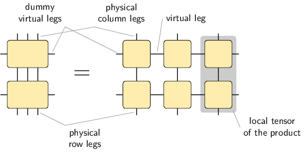

This figure tells us how to obtain the local tensors which represent
the product: We have to compute new tensors as indicated by the shaded
area.  The figure also tells us that the representation rank of the
result is the product of the representation rank of the two individual
MPO representations.

.. _intro-pmps:

Local purification form MPS (PMPS)
""""""""""""""""""""""""""""""""""

The local purification form matrix product state representation (PMPS
or LPMPS) is defined as follows:

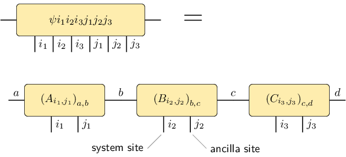

Here, all the :math:`i` indices are actual sites and all the :math:`j`
indices are ancilla sites used for the purification (reference:
e.g. [:ref:`Cue13 <Cue13>`]; :ref:`exact definition
<mpsmpo-definitions>`).  The non-negative operator described by this
representation is given by

.. math::

   \rho = \operatorname{tr}_{j_1j_2j_3}( \vert \psi \rangle \! \langle \psi \vert )

The following figure describes the relation:

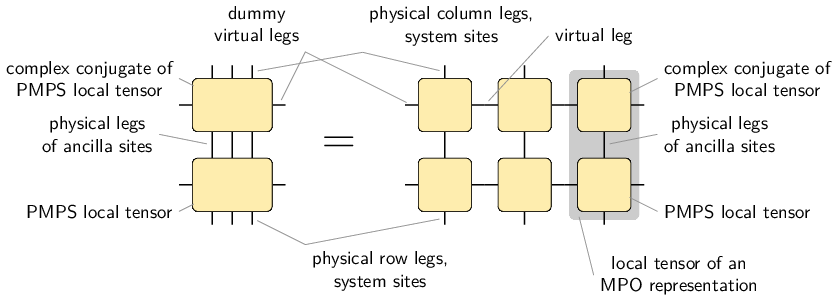

It also tells us how to convert a PMPS representation into an MPO
representation and how the representation rank changes: The MPO
representation rank is the square of the PMPS representation rank.

.. _intro-mpa:

General matrix product arrays
"""""""""""""""""""""""""""""

Up to now, all examples had the same number of legs on each
site. However, the :class:`MPArray <mpnum.mparray.MPArray>` is not
restricted to these cases, but can be used to express any local
structure. An example of a inhomogenous tensor is shown in the
following figure:

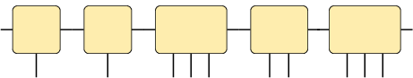

Next steps
----------

The Jupyter notebook :code:`mpnum_intro.ipynb` in the folder
:code:`Notebooks` provides an interactive introduction on how to use
:code:`mpnum` for basic MPS, MPO and MPA operations. Its rendered version
can also be viewed in the :doc:`examples/mpnum_intro`.
If you open the notebook on your own
computer, it allows you to run and modify all the commands
interactively (more information is available in the section "Jupyter
Notebook Quickstart" of the `Jupyter documentation`_).

.. _`view mpnum_intro.ipynb on Github`:
   https://github.com/dseuss/mpnum/blob/master/examples/mpnum_intro.ipynb

.. _`Jupyter documentation`:
   https://jupyter.readthedocs.io/

References
----------

.. [Sch11] Schollwöck, U. (2011). The density-matrix renormalization group in the age of matrix product states. Ann. Phys. 326(1), pp. 96–192. `DOI: 10.1016/j.aop.2010.09.012`_. `arXiv:1008.3477`_.

  .. _`DOI: 10.1016/j.aop.2010.09.012`:
     http://dx.doi.org/10.1016/j.aop.2010.09.012

  .. _`arXiv:1008.3477`: http://arxiv.org/abs/1008.3477

.. [KGE14] Kliesch, Gross and Eisert (2014). Matrix-product operators and states: NP-hardness and undecidability. Phys. Rev. Lett. 113, 160503. `DOI: 10.1103/PhysRevLett.113.160503`_. `arXiv:1404.4466`_.

  .. _`DOI: 10.1103/PhysRevLett.113.160503`:
    DOI:https://doi.org/10.1103/PhysRevLett.113.160503

  .. _`arXiv:1404.4466`: http://arxiv.org/abs/1404.4466
