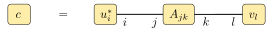
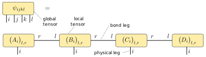
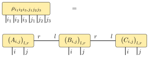
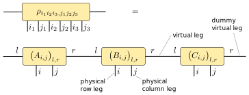
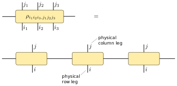
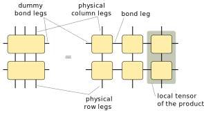
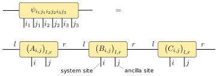
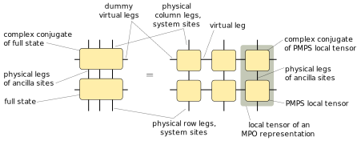

.. _mpnum-introduction:

Introduction
============

Contributing
----

Contributions to the code are very welcome.  Regarding code style,
please try to fix all warnings reported by flake8::

  python -m flake8 .

Regarding line length, we try to have not more than 80 characters per
line, with some exceptions if the excess is small and reformatting
would not be nice.

Graphical notation for tensors
----

Our graphical notation for tensors is very similar to the graphical
notation used by Schollwoeck [:ref:`Sch11 <Sch11>`, e.g. Figure 38].

Basics
""""""

Tensor contractions are much easier to write down using figures.  A
simple case of of a tensor contraction is the product of two matrices:

.. math::

   C = A B^T

We represent this tensor contraction with the following figure:

Each of the tensors :math:`A`, :math:`B` and :math:`C` is represented
by one box.  All the tensors have two indices (as they are matrices),
therefore there are two lines emerging from each box, called *legs*.
Connected legs indicate a contraction.  The relation between legs on
the left and right hand sides of the equality sign is given by their
position.  In this figure, we specify the relation between the indices
in a formula like :math:`B_{kl}` and the individual lines in the
figure by giving specifying the name of each index on each line.

In this simple case, the figure looks more complicated than the
formula, but it contains complete information on how all indices of
all tensors are connected.  To be fair, we should mention the indices
in the formula as well:

.. math::

   C_{ij} = \sum_{j} A_{ij} B_{kj}

Another simple example is the following product of two vectors and a
matrix:

.. math::

   c = u^\dagger A v = \sum_{ij} u^*_i A_{ij} v_j

This formula is represented by the following figure:

Matrix product states (MPS)
"""""""""""""""""""""""""""

The matrix product state representation of a state :math:`\vert \psi
\rangle` on four subsystems is given by

.. math::

   \langle i j k l \vert \psi \rangle = \psi_{ijkl} = A_i B_j C_k D_l

where :math:`A_i \in \mathbb C^{1 \times D}`, :math:`B_j, C_k \in
\mathbb C^{D \times D}` and :math:`D_l \in \mathbb C^{D \times 1}`
(reference: e.g. [:ref:`Sch11 <Sch11>`]; :ref:`exact definition
<mpsmpo-definitions>`).  This construction is also known as *tensor
train* and it is given by the following simple figure:

We call :math:`\psi` a *global tensor* and we call the MPS matrices
:math:`A_i`, :math:`B_j` etc. which are associated to a certain
subsystem *local tensors*.

Very often, we can omit the labels of all the legs.  The figure then
becomes very simple:

As explained in the next paragraph on MPOs, we usually add *dummy
bonds* of size 1 to our tensors:

Matrix product operators (MPO)
""""""""""""""""""""""""""""""

The matrix product operator representation of an operator :math:`\rho`
on three subsystems is given by

.. math::

   \langle i_1 i_2 i_3 \vert \rho \vert j_1 j_2 j_3 \rangle
   =
   \rho_{i_1i_2i_3,j_1j_2j_3} =
   A_{i_1j_1} B_{i_2j_2} C_{i_3j_3}

where the :math:`A_{i_1j_1}` are row vectors, the :math:`B_{i_2j_2}`
are matrices and the :math:`C_{i_3j_3}` are column vectors (reference:
e.g. [:ref:`Sch11 <Sch11>`]; :ref:`exact definition
<mpsmpo-definitions>`). This is represented by the following figure:

Be aware that the legs of :math:`\rho` are not in the order :math:`i_1
i_2 i_3 j_1 j_2 j_3` (called *global order*) which is expected from
the expression :math:`\langle i_1 i_2 i_3 \vert \rho \vert j_1 j_2 j_3
\rangle` and which is obtained by a simple reshape of the matrix
:math:`\rho` into a tensor.  Instead, the order of the legs of
:math:`\rho` must match the order in the MPO construction, which is
:math:`i_1 j_1 i_2 j_2 i_3 j_3`.  We call this latter order *local
order*. The functions :func:`global_to_local
<mpnum._tools.global_to_local>` and :func:`local_to_global
<mpnum._tools.local_to_global>` can convert tensors between the two
orders.

In order to simplify the implementation, it is useful to introduce
*dummy bonds* with index size 1 on the left and the right of the MPS
or MPO chain:

With these dummy bonds, all the tensors in the representation have
exactly two bond indices.

It is useful to draw the physical column indices upward from the
global and local tensors while leaving the physical row indices
downward:

With this arrangement, we can nicely express a product of two MPOs:

This figure tells us how to obtain the local tensors which represent
the product: We have to compute new tensors as indicated by the shaded
area.  The figure also tells us that the bond dimension of the result
is the product of the bond dimensions of the two individual MPO
representations.

Local purification form MPS (PMPS)
"""""

The local purification from matrix product state representation (PMPS
or LPMPS) is defined as follows:

Here, all the :math:`i` indices are actual sites and all the :math:`j`
indices are ancilla sites used for the purification (reference:
e.g. [:ref:`Cue13 <Cue13>`]; :ref:`exact definition
<mpsmpo-definitions>`).  The non-negative operator described by this
representation is given by

.. math::

   \rho = \operatorname{tr}_{j_1j_2j_3}( \vert \psi \rangle \! \langle \psi \vert )

The following figure describes the relation:

It also tells us how to convert a PMPS representation into an MPO
representation and how the bond dimension changes: The MPO bond
dimension is the square of the PMPS bond dimension.

Matrix product arrays
"""""

The library mpnum implements the class :class:`mpnum.mparray.MPArray`
which can be used for MPS, MPO, PMPS and other MPS-like
representations.  :code:`MPArray` is short for *matrix product array*
(MPA) and this class provides an MPS with an arbitrary number of
physical legs at each site.  Each physical leg can also have an
arbitrary dimension.  A corresponding figure could look like this:

Next steps
-----

The ipython notebook :code:`mpnum_intro.ipynb` in the folder
:code:`Notebooks` provides an introduction on how to use :code:`mpnum`
for basic MPS, MPO and MPA operations. You can also `view
mpnum_intro.ipynb on Github`_.

.. _`view mpnum_intro.ipynb on Github`:
   https://github.com/dseuss/mpnum/blob/master/examples/mpnum_intro.ipynb
